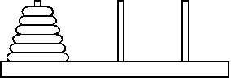

## Задача 9. Ханойские башни
### Что нужно сделать
Ниже представлен текст одной из классических головоломок и по совместительству алгоритмических задач по программированию. С ней знакомы многие, в том числе те, кто с программированием никак не связан.

Головоломка «Ханойские башни» состоит из трёх стержней, пронумерованных числами 1, 2, 3. На стержень 1 надета пирамидка из N дисков различного диаметра в порядке возрастания диаметра. Диски можно перекладывать с одного стержня на другой по одному, при этом диск нельзя класть на диск меньшего диаметра.

Необходимо переложить всю пирамидку со стержня 1 на стержень 3 за минимальное число перекладываний.



Напишите программу, которая решает головоломку — для данного числа дисков N печатает последовательность перекладываний в формате A B C, где: 

- A — номер перекладываемого диска; 
- B — номер стержня, с которого снимается данный диск; 
- C — номер стержня, на который надевается данный диск.

Например, строка 1 2 3 означает перемещение диска номер 1 со стержня 2 на стержень 3. В одной строке печатается одна команда. Диски пронумерованы числами от 1 до n в порядке возрастания диаметров.

Программа должна вывести минимальный (по количеству произведённых операций) способ перекладывания пирамидки из данного числа дисков.

Решение оформите в виде функции move (n, x, y), которая печатает последовательность перекладываний дисков для перемещения пирамидки высотой N со стержня номер X на стержень номер Y.

Пример:
```
Введите количество дисков: 2
Переложить диск 1 со стержня номер 1 на стержень номер 2
Переложить диск 2 со стержня номер 1 на стержень номер 3
Переложить диск 1 со стержня номер 2 на стержень номер 3
```

**Совет:** Для начала определите номер промежуточного колышка. Для этого подумайте о сумме трех чисел колышка. 

### Что оценивается
- Результат вычислений корректен.
- Формат вывода соответствует примеру.
- input содержит корректные приглашения для ввода. 
- Основной функционал описан в отдельной функции(-ях).
- Переменные и функции имеют значащие имена, не только a, b, c, d (подробнее об этом в видео 2.3).
